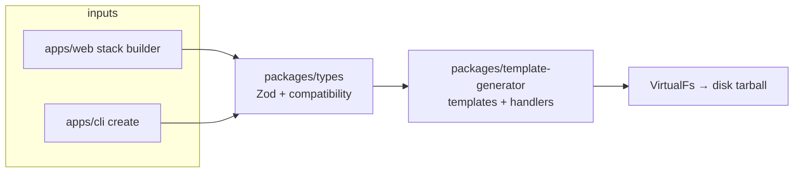

# Architecture

Veloz Stack is a pnpm + Turborepo monorepo that turns a **stack configuration** into a deployable TypeScript project. The web app and CLI share the same schemas, compatibility rules, and generator.

## Data flow

1. **Configuration** — `ProjectConfig` (see [stack-config.md](stack-config.md)) is validated by Zod and `validateConfig()` in `@veloz-stack/types`.
2. **Resolution** — `resolveStackChange()` in `@veloz-stack/types/resolve-stack` applies picker edits and records cascade fixes (e.g. `frontend: next` → `backend: next`).
3. **Generation** — `generate()` runs handlers in a fixed order (see below), then writes files to a virtual filesystem.
4. **Versions** — `versions.yaml` drives `deps.ts`, workspace catalog slices, and package-manager pins via `pnpm sync-versions`.

## Workspace layout

| Path                          | Role                                                              |
| ----------------------------- | ----------------------------------------------------------------- |
| `apps/web`                    | Next.js marketing site + `/new` stack builder                     |
| `apps/cli`                    | `create-veloz-stack` — interactive Ink UI or flags                |
| `packages/types`              | Canonical enums, labels, presets, compatibility, stack resolution |
| `packages/template-generator` | Embedded templates, Handlebars processors, scaffold pipeline      |

## Generator pipeline

Handlers live under `packages/template-generator/src/handlers/`. Order is fixed in `runGeneratePipeline()` (`src/generate-pipeline.ts`):

1. **Base stack** (`pipeline-base.ts`) — `processBase`, `processFrontend`, `processUi`
2. **Platform** (`pipeline-platform.ts`) — `processMobile`, `processDesktop`, `processBackend`
3. **Data & deploy** (`pipeline-data.ts`) — `processApi`, `processDb`, `processAuth`, `processDeploy`
4. **Extras** (`pipeline-extras.ts`) — `processModules`, `processExamples`, `processAddons`, `processTesting`, `processAdrs` (ADR stubs for **generated** projects only)
5. **`postProcess`** — shared `package.json` scripts, `.env.example`, `veloz-stack.config.json`, reproducible CLI command

Templates are embedded at build time: `pnpm gen` (in template-generator) runs `scripts/build-templates.mjs` → `src/templates.generated.ts` (gitignored).

## Architecture decision records (ADRs)

This **scaffolder repo** does not maintain its own `docs/adr/` tree. ADRs are emitted into **generated projects** via `processAdrs` (`templates/docs/adr/`). Design history for the monorepo lives in git history, [docs/plans/archive/](plans/archive/), and [CHANGELOG.md](../CHANGELOG.md).

## Backend modes

| `backend` | Meaning                                                       |
| --------- | ------------------------------------------------------------- |
| `hono`    | Separate API app (default for TanStack Start)                 |
| `next`    | Route Handlers under `apps/web/app/api` when `frontend: next` |
| `none`    | No server package                                             |

Implicit rules (e.g. Next frontend defaulting to `backend: next`) live in `applyImplicitStackRules()` in `@veloz-stack/types`.

## CI and quality gates

- **Unit job** — `sync-versions:check`, `pnpm gen`, then typecheck in two steps (avoids a race when `template-generator` regenerates `templates.generated.ts` during parallel `check-types`): `pnpm --filter @veloz-stack/template-generator exec tsc --noEmit`, then `pnpm -r --parallel --filter '!@veloz-stack/template-generator' check-types`; oxlint + oxfmt; unit tests; `pnpm docs:lint` and `pnpm docs:links`
- **E2E matrix** — `scripts/e2e-combo.sh` scaffolds each combo, copies `.env.example` → `.env` when present, installs, typechecks
- **Docs** — markdownlint + internal link check (see root `package.json` `docs:*` scripts)

## Related docs

- [stack-config.md](stack-config.md) — config file shape and axes
- [vendors.md](vendors.md) — third-party modules in templates
- [CONTRIBUTING.md](../CONTRIBUTING.md) — how to change versions and templates
