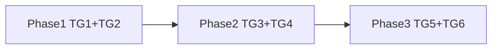

Status: **Done** (shipped)
Execution scope: all_phases
Completed: 2026-05

> **Historical plan.** `backend: "next"` is implemented in types, handlers, deploy wiring, stack builder, CLI cascades, and CI (`backend-next`, `next-hono-split`). Keep this file for design context only — do not treat the Evidence section below as current state unless re-verified.

Goal: Add `backend: "next"` to Veloz Stack so generated Next.js apps serve oRPC, Better Auth, and health checks via App Router route handlers in `apps/web`, with no `apps/server`, same-origin clients, and correct deploy/module/env wiring—while preserving `backend: "hono"` for split-server setups.

Evidence (snapshot at planning time — superseded where noted):

- [`packages/types/src/index.ts`](packages/types/src/index.ts) — `BackendId` now includes `next` (was planned-only when this doc was written).
- [`packages/template-generator/src/handlers/backend.ts`](packages/template-generator/src/handlers/backend.ts) — branches on `backend === "next"` for Route Handlers; `hono` still emits `apps/server/`.
- [`packages/template-generator/templates/api/orpc/packages/api/src/context.ts.hbs`](packages/template-generator/templates/api/orpc/packages/api/src/context.ts.hbs) — Hono-coupled `CreateContextOptions.context: HonoContext`.
- [`packages/template-generator/templates/backend/hono-node/src/index.ts.hbs`](packages/template-generator/templates/backend/hono-node/src/index.ts.hbs) — mounts `/rpc/*`, `/api/auth/*`, `/health` on port 3000.
- [`packages/template-generator/templates/frontend/next/apps/web/lib/orpc.ts.hbs`](packages/template-generator/templates/frontend/next/apps/web/lib/orpc.ts.hbs) — `NEXT_PUBLIC_SERVER_URL ?? "http://localhost:3000"`.
- [`packages/template-generator/templates/frontend/next/apps/web/package.json.hbs`](packages/template-generator/templates/frontend/next/apps/web/package.json.hbs) — already includes `@orpc/server` and `@proj/api`.
- [`packages/template-generator/src/handlers/post-process.ts`](packages/template-generator/src/handlers/post-process.ts) — module deps wire to `apps/server/package.json` only.
- [`packages/template-generator/src/handlers/deploy.ts`](packages/template-generator/src/handlers/deploy.ts) — `velozJson` always adds `apps/server` when `backend !== "none"`.
- [`packages/template-generator/templates/deploy/veloz/Dockerfile`](packages/template-generator/templates/deploy/veloz/Dockerfile) — Hono-only CMD and health on `:3000/health`.
- [`packages/template-generator/src/__tests__/generator.test.ts`](packages/template-generator/src/__tests__/generator.test.ts) — module wiring tests assert `apps/server/package.json`.
- [`.github/workflows/ci.yml`](.github/workflows/ci.yml) — e2e includes `frontend-next`, `backend-next`, `next-hono-split`, and invalid-combos for `backend next` + wrong frontend/runtime/deploy.
- External: [oRPC Next adapter](https://orpc.dev/docs/adapters/next), [Better Auth Next.js integration](https://www.better-auth.com/docs/integrations/next) (`toNextJsHandler`, `nextCookies`).

Non-goals:

- tRPC, REST, Clerk template implementations (types only today).
- oRPC SSR `createRouterClient` / `instrumentation.ts` optimization.
- Cloudflare Workers + `backend: next`.
- Changing default Veloz BR preset from `hono` to `next` without explicit product approval.
- Research pipeline artifacts (repo has no `docs/research/*` or `scripts/research-competitor-intel.mjs`).

Research metadata:

- status: research-pending
- research_failure: No `docs/research/top10-lock.json`, `docs/research/capability-evidence.json`, or `scripts/research-competitor-intel.mjs` in this repository.
- risk_acknowledged: true
- compensating_rationale: Feature is generator-internal parity with documented oRPC/Better Auth Next patterns; competitor matrix deferred until research pipeline lands. Parity reference: T3 Turbo / create-t3-app (Next API routes + tRPC), Better-T-Stack (split server)—Veloz differentiates by optional `backend: next` same-origin path.

## What already exists

- Full **Hono + oRPC + Better Auth** path: `apps/server` + cross-origin Next client.
- **Next frontend** templates under `templates/frontend/next/` (port 3001, oRPC client, TanStack Query demo page).
- **Shared** `packages/api` router and `packages/auth` server instance.
- **Stack builder** ([`apps/web`](apps/web)) and **CLI** ([`apps/cli`](apps/cli)) already expose `backend` via `BackendId` and `getBackendDisableReason`.
- **CI** runs `pnpm gen`, unit tests, and broad e2e scaffold matrix.

## NOT in scope

- Implementing `express` / `fastify` / `elysia` backends (enum placeholders only).
- Next.js Route Handlers for tRPC/REST.
- Clerk auth templates.
- Forcing all Next frontends to use `backend: next` (user choice: `next` vs `hono`).
- Browser QA of generated apps in this PR (generator unit/e2e only unless manual spot-check).

## File map

| Action   | Path                                                                                                                                                                               |
| -------- | ---------------------------------------------------------------------------------------------------------------------------------------------------------------------------------- |
| Edit     | [`packages/types/src/index.ts`](packages/types/src/index.ts) — add `"next"` to `BackendId`                                                                                         |
| Edit     | [`packages/types/src/compatibility.ts`](packages/types/src/compatibility.ts) — next↔frontend, next↔workers, optional next↔cloudflare deploy                                        |
| Edit     | [`apps/web/lib/option-hints.ts`](apps/web/lib/option-hints.ts)                                                                                                                     |
| Edit     | [`packages/template-generator/templates/api/orpc/packages/api/src/context.ts.hbs`](packages/template-generator/templates/api/orpc/packages/api/src/context.ts.hbs)                 |
| Edit     | [`packages/template-generator/templates/api/orpc/packages/api/package.json.hbs`](packages/template-generator/templates/api/orpc/packages/api/package.json.hbs) — remove `hono` dep |
| Edit     | [`packages/template-generator/templates/backend/hono-node/src/index.ts.hbs`](packages/template-generator/templates/backend/hono-node/src/index.ts.hbs)                             |
| Edit     | [`packages/template-generator/templates/backend/hono-bun/src/index.ts.hbs`](packages/template-generator/templates/backend/hono-bun/src/index.ts.hbs)                               |
| Edit     | [`packages/template-generator/templates/backend/hono-workers/src/index.ts.hbs`](packages/template-generator/templates/backend/hono-workers/src/index.ts.hbs)                       |
| Add      | `packages/template-generator/templates/backend/next/apps/web/app/api/rpc/[...path]/route.ts.hbs`                                                                                   |
| Add      | `packages/template-generator/templates/backend/next/apps/web/app/api/auth/[...all]/route.ts.hbs`                                                                                   |
| Add      | `packages/template-generator/templates/backend/next/apps/web/app/api/health/route.ts.hbs`                                                                                          |
| Edit     | [`packages/template-generator/src/handlers/backend.ts`](packages/template-generator/src/handlers/backend.ts) — `next` branch                                                       |
| Edit     | [`packages/template-generator/templates/frontend/next/apps/web/lib/orpc.ts.hbs`](packages/template-generator/templates/frontend/next/apps/web/lib/orpc.ts.hbs) — conditional URL   |
| Add/Edit | `packages/template-generator/templates/auth/better-auth/next/` — Next auth client + conditional `nextCookies` in core `index.ts.hbs`                                               |
| Edit     | [`packages/template-generator/templates/base/.env.example.hbs`](packages/template-generator/templates/base/.env.example.hbs)                                                       |
| Edit     | [`packages/template-generator/src/handlers/deploy.ts`](packages/template-generator/src/handlers/deploy.ts)                                                                         |
| Add      | `packages/template-generator/templates/deploy/veloz/Dockerfile.next.hbs` (or conditional Dockerfile)                                                                               |
| Edit     | [`packages/template-generator/src/handlers/post-process.ts`](packages/template-generator/src/handlers/post-process.ts)                                                             |
| Edit     | [`packages/template-generator/src/__tests__/generator.test.ts`](packages/template-generator/src/__tests__/generator.test.ts)                                                       |
| Edit     | [`.github/workflows/ci.yml`](.github/workflows/ci.yml) — e2e + invalid-combo rows                                                                                                  |
| Edit     | [`README.md`](README.md) — document `backend: next`                                                                                                                                |

## Task groups

### TG1 — Types, validation, UX (disjoint: `packages/types`, `apps/web/lib`)

- Extend `BackendId` with `"next"`.
- `getBackendDisableReason("next")`: require `frontend === "next"`.
- `getRuntimeDisableReason`: reject `workers` when `backend === "next"`.
- `getDeployDisableReason` (recommended): reject `deploy === "cloudflare"` when `backend === "next"` with clear message.
- Add `option-hints.ts` entry for `next` backend.
- **Verification:** `pnpm --filter @veloz-stack/types check-types`; unit test in `generator.test.ts` for `validateConfig` rejects `next` + `tanstack-start`.

### TG2 — API context refactor (disjoint: `templates/api`, `templates/backend/hono-*`)

- Replace Hono context with `{ headers: Headers }` in `context.ts.hbs`.
- Update all three Hono `index.ts.hbs` to `createContext({ headers: c.req.raw.headers })`.
- Remove `hono` from `packages/api/package.json.hbs`.
- **Verification:** generate default + `frontend next, backend hono` configs; assert context file has no `HonoContext`; Hono server still references `createContext`.

### TG3 — Next route templates + backend handler (disjoint: `templates/backend/next`, `handlers/backend.ts`)

- Add route templates per oRPC Next adapter (all HTTP methods on RPC handler).
- Auth route: `toNextJsHandler(auth)` from `better-auth/next-js`.
- Health route: `GET` → `{ ok: true }`.
- `processBackend`: when `backend === "next"`, `processTemplatesFromPrefix(..., "backend/next/", "apps/web/", config)` and **skip** `apps/server` emission.
- Gate: only when `frontend === "next"` (enforced by compat).
- **Verification:** generate `frontend: next, backend: next`; assert route files exist; assert no `apps/server/src/index.ts`.

### TG4 — Clients, auth, env (disjoint: `templates/frontend/next`, `templates/auth`, `templates/base`)

- `orpc.ts.hbs`: branch on `backend`:
  - `next`: same-origin `/rpc` + `credentials: "include"` when Better Auth.
  - `hono`: keep `NEXT_PUBLIC_SERVER_URL` (document in `.env.example`).
- Auth client for Next:
  - `backend === "next"`: `baseURL` from `window.location.origin` / `APP_URL` (port 3001).
  - `backend === "hono"`: `NEXT_PUBLIC_SERVER_URL` (new—fixes latent VITE-only client for Next+Hono).
- Conditional `nextCookies()` in auth `index.ts.hbs` when `backend === "next"`.
- `.env.example.hbs`: when `backend === "next"`, `APP_URL` and `BETTER_AUTH_URL` default to `http://localhost:3001`; comment on Expo `EXPO_PUBLIC_SERVER_URL` pointing at Next origin.
- **Verification:** generated `orpc.ts` and `auth` client strings match backend choice.

### TG5 — Deploy, modules, docs (disjoint: `handlers/deploy.ts`, `handlers/post-process.ts`, `templates/deploy`, `README`)

- `velozJson`: omit `apps/server` when `backend === "next"`; set web `healthCheck.path` to `/api/health`.
- Dockerfile: emit Next-specific variant (build `apps/web`, `next start -p 3001`, health `/api/health`).
- `post-process`: wire `SERVER_WORKSPACE_PACKAGES` to `apps/web/package.json` when `backend === "next"`.
- README: Vercel-native recommendation (`--frontend next` with implicit `backend: next`; split via `--backend hono`).
- **Verification:** generator tests for veloz.json services; abacatepay module on `apps/web` when `backend: next`.

### TG6 — CI and regression tests (disjoint: `generator.test.ts`, `ci.yml`)

- New generator test cases (see Test plan).
- E2E matrix: `{ name: backend-next, args: "--frontend next --backend next" }`.
- E2E matrix: `{ name: next-hono-split, args: "--frontend next --backend hono" }` (regression).
- Invalid-combos: `backend next + frontend tanstack-start`; `backend next + runtime workers`.
- **Verification:** full CI commands in Verification gates.

## Phases

### Phase 1 — Foundation (TG1 + TG2)

**Workstream:** types-compat, context-refactor  
**UAT Gate:** `validateConfig` passes/fails correctly; Hono-generated projects unchanged in RPC mount behavior.

1. Ship `BackendId` + compatibility + hints.
2. Ship headers-based `createContext` + Hono call-site updates + drop hono from api package.
3. Run unit tests + generate snapshot configs for regression diff.

### Phase 2 — Next backend emission (TG3 + TG4)

**Workstream:** next-routes, clients-auth-env  
**UAT Gate:** Scaffold `veloz-test-next-api` with `--frontend next --backend next --auth better-auth`; `pnpm install && pnpm --filter @veloz-test-next-api/web dev`; browser hits `/` health query OK; `/api/health` returns `{ok:true}`.

1. Add `backend/next` templates and handler branch.
2. Conditional orpc + auth client + env + `nextCookies`.
3. Generator tests for file presence and string assertions.

### Phase 3 — Ops wiring (TG5 + TG6)

**Workstream:** deploy-modules-ci  
**UAT Gate:** CI green; optional local `node-vercel-next` + new `backend-next` e2e combos scaffold and typecheck.

1. Deploy + post-process + Dockerfile.next.
2. CI matrix + invalid combos + README.
3. `pnpm gen` + full verification gate.

## Skill/tool routing

| Phase          | Tool / agent        | Mode                                                                   |
| -------------- | ------------------- | ---------------------------------------------------------------------- |
| 1–3            | Primary implementer | `etrnl-executor` or default agent                                      |
| 2              | Spec review         | `etrnl-spec-reviewer` (read-only) on context + route handler contracts |
| 3              | Quality review      | `etrnl-quality-reviewer` on generator tests                            |
| Optional       | Adversarial pass    | `etrnl-adversary` on Hono regression + auth URL matrix                 |
| Post-merge UAT | `etrnl-browser-qa`  | Only if manually validating scaffolded app in browser                  |

**WebSearch policy:** Allowed for oRPC/Better Auth API surface confirmation only; implementation must follow repo templates.

## Test plan

- [x] `pnpm --filter @veloz-stack/template-generator gen`
- [x] `pnpm --filter @veloz-stack/template-generator test`
- [x] `pnpm -r --parallel check-types`
- [x] Generator: `next+next` emits rpc/auth/health routes, no server
- [x] Generator: `next+hono` still emits server (regression)
- [x] Generator: `validateConfig` rejects `next` without `next` frontend
- [x] Generator: abacatepay → `apps/web` deps when `backend: next`
- [x] Generator: veloz deploy single web service when `backend: next`
- [x] CI invalid: `backend next + frontend tanstack-start` exits non-zero
- [ ] Manual (optional): scaffold + `curl localhost:3001/api/health`

## Failure modes

| Failure                                           | Mitigation                                                                                                  |
| ------------------------------------------------- | ----------------------------------------------------------------------------------------------------------- |
| Hono `createContext` signature break              | Update all three hono templates in same PR as context refactor; test hono default config                    |
| Better Auth cookies fail same-origin              | `nextCookies()` plugin + `credentials: "include"` on RPCLink                                                |
| Next+Hono auth client still uses VITE URL         | Branch auth client template on `backend`                                                                    |
| Module packages missing at runtime                | post-process targets `apps/web` for `backend: next`; api package.json already lists module deps for routers |
| Veloz Docker still runs Hono                      | Separate `Dockerfile.next` selected in deploy handler                                                       |
| Expo can't reach API                              | Document `EXPO_PUBLIC_SERVER_URL=http://<next-host>:3001`                                                   |
| Users pick `backend: next` + `deploy: cloudflare` | Compatibility disable with message                                                                          |

## Parallelization strategy

- **Phase 1** must complete before Phase 2 (route handlers depend on new `createContext`).
- **TG1** and **TG2** can run in parallel (disjoint paths).
- **TG3** and **TG4** can run in parallel after Phase 1.
- **TG5** depends on TG3 (deploy assumes routes exist).
- Single integration owner merges and runs full verification gate.

## Verification gates

| Gate                 | Command                                                                                                         | Owner       |
| -------------------- | --------------------------------------------------------------------------------------------------------------- | ----------- |
| Embed templates      | `pnpm --filter @veloz-stack/template-generator gen`                                                             | implementer |
| Unit                 | `pnpm --filter @veloz-stack/template-generator test`                                                            | implementer |
| Monorepo types       | `pnpm -r --parallel check-types`                                                                                | implementer |
| Local scaffold smoke | `tsx apps/cli/src/index.ts /tmp/v-next --yes --frontend next --backend next --pm pnpm` then typecheck in output | implementer |
| Plan readiness       | `node ~/.claude/scripts/plan-readiness-check.mjs docs/plans/archive/next-backend-routes.plan.md`                | autoplan    |
| CI                   | GitHub Actions on PR                                                                                            | CI          |

## Rollback

- Revert PR; `BackendId` without `next` restores UI disable for unknown backend.
- Generated projects already shipped with `backend: next` are unaffected (template output is forward-only).
- If partial deploy: keep context refactor (safe for Hono) and revert only `backend/next` templates + handler branch.

## Execution handoff

Invoke `/etrnl-execute` with this plan path: `docs/plans/archive/next-backend-routes.plan.md`.

**Question policy for execute:**

- Auto-continue Phases 1–3 mechanical work.
- Ask before: changing default preset to `backend: next`, destructive CI matrix reductions, or scope expansion (SSR client, Cloudflare Next).

**Subagent task packet (TG3 — example):**

- **goal:** Emit Next App Router API routes for oRPC/auth/health
- **context:** `backend: next` skips `apps/server`; uses shared `packages/api`
- **scope:** `templates/backend/next/**`, `handlers/backend.ts` only
- **read set:** hono-node index, oRPC Next docs, existing context.ts.hbs
- **write scope:** paths above
- **forbidden:** `packages/types` (owned by TG1), hono templates except context call line if needed
- **verification:** `pnpm --filter @veloz-stack/template-generator test -t "backend next"`
- **model:** default
- **do-not-revert:** TG2 context refactor

## Autoplan decision log

| Phase       | Decision                                      | Rationale                                                                | Consensus | Gate              |
| ----------- | --------------------------------------------- | ------------------------------------------------------------------------ | --------- | ----------------- |
| CEO         | Add `backend: next` as optional, keep Hono    | Next users expect native routes on Vercel; power users keep split server | Unanimous | none              |
| CEO         | Do not change Veloz BR default preset         | Avoid breaking existing docs/expectations                                | Unanimous | taste (logged)    |
| Eng         | Headers-based `createContext`                 | Single `packages/api` for Hono + Next                                    | Unanimous | none              |
| Eng         | Include full deploy/module/CI in one delivery | User requested full scope                                                | Unanimous | none              |
| Design      | Same-origin removes CORS friction             | Better Auth cookie flow                                                  | Unanimous | none              |
| Design      | No stack-builder visual redesign              | Hint text only                                                           | Unanimous | none              |
| DX          | Branch auth client for next vs hono           | Fix VITE-only client for Next+Hono                                       | Unanimous | none              |
| DX          | Document env for Expo → Next origin           | Mobile unchanged architecturally                                         | Unanimous | none              |
| Adversarial | Block `workers` + `next` backend              | No Workers entry for Next API                                            | Unanimous | none              |
| Adversarial | Hono regression test mandatory                | Context refactor is blast radius                                         | Unanimous | none              |
| Research    | Mark research-pending                         | No research pipeline in repo                                             | N/A       | risk_acknowledged |

## Artifact requirements

| Artifact                 | When                                    |
| ------------------------ | --------------------------------------- |
| `review-log.jsonl`       | If spec/quality reviewers file findings |
| `browser-qa-report.json` | Optional post-scaffold manual UAT only  |
| context-save             | If execution spans multiple sessions    |

## Assumptions

- oRPC `RPCHandler` from `@orpc/server/fetch` works in Next 15 Route Handlers without extra adapter package (per official docs).
- Better Auth `toNextJsHandler` + `nextCookies` versions match pinned `better-auth` in [`deps.ts`](packages/template-generator/src/deps.ts).
- Generated apps remain client-heavy; SSR oRPC forwarding is not required for first ship.
- `packages/api` module deps (e.g. abacatepay) remain on api package; `apps/web` workspace deps mirror Hono server wiring for runtime resolution in monorepo.

## Plan Readiness Report

- Scope Challenge: Delivers the user-asked `backend: next` option without removing Hono; scope is bounded to generator templates and compat, not implementing placeholder backends.
- Architecture Review: Clean split—shared router package, thin Route Handlers, compatibility gates prevent invalid combos; deploy becomes single-service for Vercel/Veloz.
- Code Quality Review: Context decoupling reduces package coupling; conditional templates via existing Handlebars `eq` helpers; post-process target abstraction is minimal diff.
- Test Review: Generator unit tests plus two CI e2e combos and two invalid-combo guards; aligns with existing test style in `generator.test.ts`.
- Performance Review: Same-origin removes extra hop vs split server for Next-only deploys; no edge runtime claims; N/A for generator-only change.
- Failure modes: Auth cookies, Docker still targeting Hono, module wiring to wrong package, Expo URL misconfiguration—each has mitigation in Failure modes section.
- Parallelization: Three phases; TG1/TG2 parallel in Phase 1; TG3/TG4 parallel in Phase 2 after context refactor lands.
- Final decision inputs: Research pending but risk acknowledged; user confirmed `new_backend_option` and full scope including deploy/modules/CI.

## Verdict

**Ready for execution** — with `research-pending` noted; no code-level competitor evidence required to implement generator feature. Run `node ~/.claude/scripts/plan-readiness-check.mjs docs/plans/archive/next-backend-routes.plan.md` before `/etrnl-execute`.
